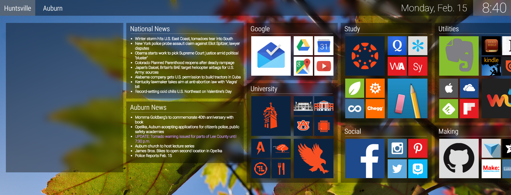

# mcberry23.github.io
http://mcberry23.github.io/ 
</img> 
<h3>Overview</h3>

This is a personal homepage dashboard designed to include weather, news, and commonly used links.  It uses similar styles to Windows 10 and Windows 8.  After iGoogle has been discontinued I have had trouble finding a good homepage.  I was learning how to create websites at the time and so I decided to create my own.  It is very personalized to my own needs but feel free to fork it and branch off from it on your own.  It is coded entirely with HTML, CSS, Javascript, and JQuery.  For the weather I use simpleweather.js.  For the news feeds, I use RSS.

